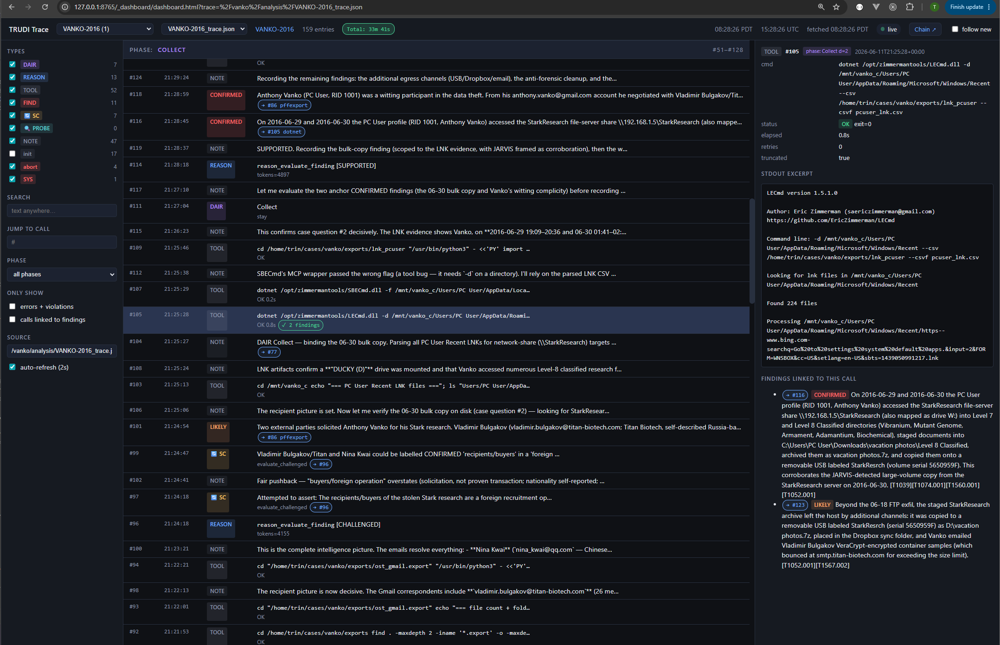
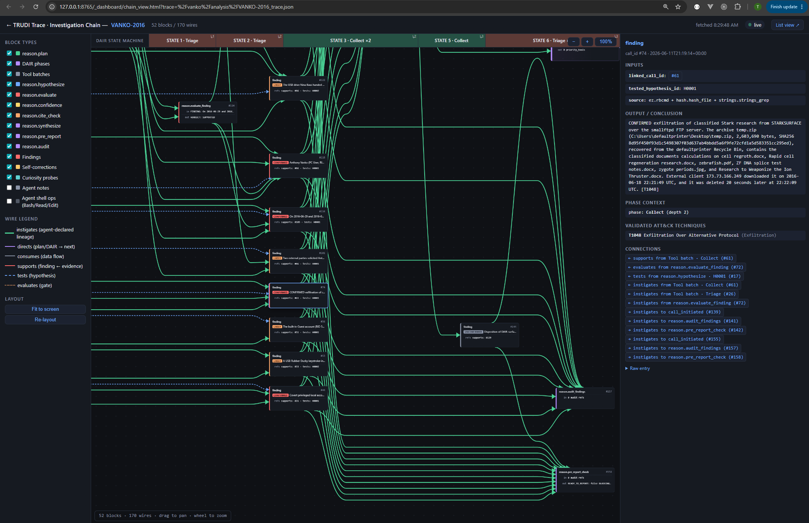

# TRUDI

**Threat Response Unit for Digital Investigation**

Autonomous DFIR agent built on the SANS SIFT Workstation. TRUDI runs a complete incident response investigation — disk triage, memory forensics, Windows artifact parsing, IOC enrichment, YARA hunting — and produces a structured analyst report with a full audit trail, without prompting for confirmation at each step.

A separate model directs the investigation phase-by-phase, and an adversarial reviewer challenges every conclusion before it reaches the report. TRUDI only reports what survives review.

Built for the [Find Evil! hackathon](https://findevil.devpost.com/) — SANS Institute / Devpost, April–June 2026.

---

## How it works

TRUDI is a **three-model system** — one analyst and two independently-configured reasoning models that direct and challenge it:

**Claude (primary analyst)** — orchestrates the investigation, selects tools, runs them via the TRUDI MCP server, interprets output, and writes the report.

**DAIR phase director** (`dair.*`) — runs the investigation as a recursive state machine (Triage → Collect → Analyze → Scan → Report). After every tool batch, `dair_assess` re-reads the evidence picture, decides the next phase, and emits a bound `priority_tools` work order. **DAIR prescribes; Claude executes.** Its backend is configured independently via `DAIR_BACKEND`.

**Adversarial reviewer** (`reason.*`) — challenges the investigation from two directions:

1. **Upstream** — at each Triage entry it generates a prioritized plan and competing hypotheses (including at least one non-leading actor/mechanism), binding which discriminating tools run first.
2. **Downstream** — before any conclusion reaches the report it evaluates the finding, scores confidence, checks citations, and runs a pre-report gate — flagging unsupported claims, logical gaps, and alternative explanations.

Both reasoning surfaces are swappable: `REASON_BACKEND` and `DAIR_BACKEND` each accept the Claude API (default), any OpenAI-compatible endpoint, or a local Foundation-Sec-8B-Reasoning server, and may point at different models. The models exchange structured `DIRECTIVES` blocks that bind tool selection for the next phase. Disagreements are resolved by a capped self-correction loop (max 3 iterations); unresolved items are reported as `UNCERTAIN` rather than dropped.

> **Find Evil! submission configuration:** the hackathon submission runs entirely on Claude — Claude Code (Opus) as the primary analyst, with **Opus** as both the reasoning (`REASON_BACKEND=claude`) and DAIR (`DAIR_BACKEND=claude`) models. No local model server is required.

### Execution flow

```
case opened
    │
    ├─ misc.start_execution_log           ← trace log initialized
    ├─ [parallel] pre-plan triage         ← ez.recmd_hive ×3 + vol.symbol_check + hash.verify_evidence_hash
    ├─ reason.hypothesize (case question)  ← competing hypotheses, incl. ≥1 non-leading
    ├─ reason.plan                         ← prioritized Triage plan
    │
    └─ DAIR loop ── repeats until next_phase = Report ───────────────┐
         ├─ dair.dair_assess              ← phase decision + priority_tools work order
         ├─ [tool batch — disk, memory, artifacts, network, …]       │  (+ optional curiosity probes)
         │      └─ reason.hypothesize     ← per suspicious artifact   │
         └─ dair.dair_assess (results) ──────────────────────────────┘
    │
    (before any CONFIRMED/LIKELY finding)
    ├─ reason.evaluate_finding / confidence_score / cite_check
    ├─ misc.record_finding                 ← gated, linked to source call_id
    │
    (Report phase)
    ├─ reason.synthesize                   ← cross-finding consistency check
    ├─ reason.pre_report_check             ← blocks until findings + attribution resolved
    ├─ misc.export_execution_log           ← trace written to reports/
    └─ misc.write_final_report             ← gated final report write
```

Every tool call, DAIR call, reason call, and confirmed finding is written to a live JSON trace log throughout the investigation. The markdown export is human-readable.

---

## Prerequisites

1. **SANS SIFT Workstation** — Ubuntu 22.04 x86-64 with forensic tools (Volatility 3, EZ Tools, Sleuth Kit, Plaso, YARA, bulk_extractor, etc.)
   - Download: https://www.sans.org/tools/sift-workstation/

2. **Protocol SIFT** — installs Claude Code and the forensic skill playbooks
   - Install: https://github.com/teamdfir/protocol-sift

3. **Python 3.10+** and **dotnet** — both included in SIFT Workstation

4. **Reasoning backends** *(optional but recommended)*
   TRUDI uses two independently-configured reasoning models — the adversarial reviewer (`REASON_BACKEND`) and the DAIR phase director (`DAIR_BACKEND`). Each takes the same options and may point at the same or different models:

   | Backend | Config |
   |---------|--------|
   | `claude` (default) | `ANTHROPIC_API_KEY=sk-ant-...` — no server required |
   | `openai-compat` | `REASON_URL` / `DAIR_URL` + `REASON_API_KEY` / `DAIR_API_KEY` |
   | Foundation-Sec (local) | `…_BACKEND=openai-compat` + `…_URL=http://localhost:8000` |
   | Foundation-Sec (HF) | `…_BACKEND=openai-compat` + `…_URL=<hf-endpoint>` + `…_API_KEY=hf_...` |

   The submission runs both on `claude` with Opus (see [How it works](#how-it-works)). TRUDI degrades gracefully if a backend is unconfigured — reason and DAIR calls are logged as skipped.

---

## Setup

```bash
git clone https://github.com/nebulae/trudi ~/trudi
cd ~/trudi
./install.sh
```

`install.sh` does the following:

- Checks for `python3`, `dotnet`, and `claude` CLI
- Creates a Python venv at `~/.venv` and installs all dependencies
- Copies `.env.example` → `.env` (edit this to add API keys)
- **Backs up** any existing `~/.claude/CLAUDE.md` with a UTC timestamp, then installs the TRUDI orchestrator
- Registers Claude Code hooks, slash commands, and skills (hooks run directly from the repo — no drift-prone deployed copies)
- Registers the TRUDI MCP server globally with `claude mcp add --scope global`
- Runs the full test suite (1,100+ tests) as a smoke check

If `~/.claude/CLAUDE.md` already exists (e.g. from a Protocol SIFT install), the backup is written to `~/.claude/CLAUDE.md.<YYYYMMDDTHHMMSS>.bak` — the original is never overwritten without a backup.

### API keys

Edit `~/trudi/.env`. TRUDI runs without any keys, but **missing keys degrade the run rather than break it** — and the degradation is not cosmetic:

| Key | Powers | If absent |
|-----|--------|-----------|
| `ANTHROPIC_API_KEY` | The `reason.*` reviewer and `dair.*` director (when `…_BACKEND=claude`) | **Reason and DAIR calls are skipped.** Findings are never challenged, confidence-scored, or citation-checked; phase direction falls back to a static path. The audit trail and analytical rigor that distinguish a TRUDI run are lost. |
| `VIRUSTOTAL_API_KEY` | `enrich.vt_lookup_*` | Hash/IP/domain reputation lookups return "unconfigured"; everything else proceeds. |
| `ABUSEIPDB_API_KEY` | `enrich.abuseipdb_check` | IP abuse scoring skipped; everything else proceeds. |

> **Required for a hackathon entry run:** `ANTHROPIC_API_KEY`. The submission runs the primary analyst, the reviewer, and the DAIR director all on Claude/Opus (see [How it works](#how-it-works)), so this one key is what makes a run a *real* TRUDI run — the adversarial review and phase direction depend on it. The two enrichment keys are recommended (they add IOC corroboration) but optional and never block the investigation.

```bash
# IOC enrichment
VIRUSTOTAL_API_KEY=your_key_here
ABUSEIPDB_API_KEY=your_key_here

# Reasoning backends — reviewer + DAIR director (both default to claude)
REASON_BACKEND=claude
DAIR_BACKEND=claude
ANTHROPIC_API_KEY=sk-ant-...          # Claude API — used by both when backend=claude

# Submission default: Opus for both reasoning and DAIR
REASON_MODEL=claude-opus-4-8
DAIR_MODEL=claude-opus-4-8

# Or point either backend at an OpenAI-compatible / local endpoint:
# REASON_BACKEND=openai-compat
# REASON_URL=https://api.openai.com/v1   # or http://localhost:8000 for local vLLM
# REASON_API_KEY=sk-...
# DAIR_BACKEND=openai-compat
# DAIR_URL=http://localhost:8001         # may differ from REASON_URL
```

**Foundation-Sec (openai-compat backend, local vLLM):**
```bash
pip install vllm
vllm serve "fdtn-ai/Foundation-Sec-8B-Reasoning" \
  --reasoning-parser minimax_m2 \
  --quantization bitsandbytes --load-format bitsandbytes  # for <24 GB VRAM
# then set: REASON_BACKEND=openai-compat, REASON_URL=http://localhost:8000
```

---

## Starting a case

### 1. Create the case directory

```bash
cp -r ~/trudi/case-template ~/cases/<CASE_ID>
```

### 2. Edit the case CLAUDE.md

Fill in evidence paths, hostnames, and scope in `~/cases/<CASE_ID>/CLAUDE.md`. This is the only manual step — everything else is autonomous.

```
~/cases/<CASE_ID>/
├── CLAUDE.md                  ← edit this
├── .claude/
│   └── settings.json          ← MCP tool allowlist (pre-populated)
├── evidence/                  ← place disk images and memory captures here
├── analysis/                  ← intermediate artifacts (auto-created)
├── exports/                   ← tool output: CSV, JSON, bodyfiles (auto-created)
└── reports/                   ← final report + trace log (auto-created)
```

### 3. Place evidence

```bash
cp /path/to/image.E01 ~/cases/<CASE_ID>/evidence/
cp /path/to/memory.img ~/cases/<CASE_ID>/evidence/
```

### 4. Open Claude Code in the case directory

```bash
cd ~/cases/<CASE_ID>
claude
```

### 5. Start the investigation

```
Investigate this case. Start with the pre-enumeration triage, then follow the plan.
```

TRUDI will run autonomously from there. It will not ask for confirmation between steps. Final output is a structured report in `reports/` and a full execution trace in both JSON and markdown.

---

## Live monitoring & autonomous response (experimental)

> **Status: in progress, not part of the Find Evil! submission.** This layer runs today but is experimental scaffolding; the judged submission is the read-only static investigator described above. It's documented here for completeness.

Beyond static-image investigation, TRUDI can watch a live endpoint via Velociraptor and respond autonomously. This is the only mode where TRUDI writes to a system, and only *outside* the evidence boundary, through a separately gated path.

- `monitor.*` — baseline capture, watcher lifecycle, alert draining, per-investigation traces
- `velo.*` — read-only Velociraptor API (clients, artifact collection, VQL)
- `live.*` — read-only live triage over SSH (processes, network, persistence, services, logons)
- `respond.*` — **gated** containment (process suspend/kill, network block) over a structured, type-validated SSH path

**Auto-protect** (default on) auto-executes the *reversible + low-risk* tier of containment and surfaces each action's rollback command; anything destructive (irreversible, or risk ≥ medium) pauses the loop until the operator types `approve ACT-N`. The auto-vs-approval boundary is server-classified from each recipe's `risk`/`reversible` metadata — the agent cannot reclassify it. See [`demo/live-monitoring/`](demo/live-monitoring/) for one-command bring-up.

---

## What gets produced

| File | Contents |
|------|----------|
| `reports/<CASE_ID>_investigation_report.md` | Structured analyst report — executive summary, attack timeline, findings with confidence levels, environment caveats |
| `reports/<CASE_ID>_trace.md` | Human-readable audit trail — every tool call, reason call, and confirmed finding with UTC timestamps |
| `reports/<CASE_ID>_trace.json` | Machine-readable trace — same data, structured for ingestion |
| `analysis/<CASE_ID>_trace.json` | Live trace (written incrementally during the investigation) |
| `exports/` | Raw tool output — MFT CSV, EVTX exports, prefetch, registry, amcache, shimcache, USN journal, netscan, etc. |

## Trace dashboard

Every investigation writes a live JSON trace; the bundled dashboard renders it in the browser as it runs. Launch it once and it serves every case under `~/cases`:

```bash
./dashboard.sh                 # serves ~/cases on http://127.0.0.1:8765
./dashboard.sh --port 9090
./dashboard.sh --cases-root /data/cases
```

`install.sh` also installs a `trudi-dashboard` launcher to `/usr/local/bin`. At case open TRUDI prints the live dashboard URL for the active trace, so you can watch the investigation unfold in real time.

| View | Shows |
|------|-------|
| **Trace Viewer** | Chronological stream of every tool call, DAIR call, reason call, and finding — UTC timestamps, arguments, and gate results |
| **Investigation Chain** | Finding-lineage chain — each finding linked back through `input_call_ids` to the exact tool executions that produced it |
| **Investigation Graph** | The trace as a causal DAG — hypotheses, tool runs, and findings as nodes; lineage as edges |

**Trace Viewer** — every tool / DAIR / reason call and finding, with arguments and gate results:



**Investigation Chain** — each finding linked back through `input_call_ids` to the exact tool executions that produced it:



<!-- Graph view: drop docs/media/dashboard-graph.png and uncomment:

-->

> 📹 **Demo video:** [Find Evil! — TRUDI walkthrough](https://youtu.be/Dbx5DcH6V5E)

---

## Find Evil! submission components

The eight required submission components and where each one lives. Items marked **Devpost** are entered on the [submission page](https://findevil.devpost.com/); everything else is in this repo and linked below.

| # | Component | Where |
|---|-----------|-------|
| 1 | Code Repository | This repo (MIT — see [LICENSE](LICENSE)) |
| 2 | Demo Video | [YouTube](https://youtu.be/Dbx5DcH6V5E) (also on **Devpost**) |
| 3 | Architecture Diagram | [docs/architecture.md](docs/architecture.md) · [Mermaid source](docs/architecture.mmd) |
| 4 | Written Project Description | [docs/project-description.md](docs/project-description.md) (mirrors the **Devpost** story) |
| 5 | Dataset Documentation | _TODO — no standalone doc yet_ |
| 6 | Accuracy Report | _TODO — draft inputs in [docs/hallucination-catches.md](docs/hallucination-catches.md); generate with `accuracy.accuracy_export_report`_ |
| 7 | Try-It-Out Instructions | [Setup](#setup) + [Starting a case](#starting-a-case) (this README) |
| 8 | Agent Execution Logs | Auto-generated per case to `reports/<CASE_ID>_trace.{json,md}` via `misc.export_execution_log`; sample audit log at [docs/analysis/](docs/analysis/) |

Supporting material: [docs/live-endpoint-testing.md](docs/live-endpoint-testing.md) (live-monitoring walkthrough), [docs/media/](docs/media/README.md) (dashboard screenshots + demo video notes).

> **For judges:** start with the [How it works](#how-it-works) overview, then [Try-It-Out](#setup). Every finding in an execution log (#8) links to the exact tool call that produced it — viewable live in the [Trace dashboard](#trace-dashboard).

---

## Tool namespaces

All forensic execution goes through the TRUDI MCP server — **24 namespaces** in total. Claude never calls binaries directly when an MCP tool exists.

| Namespace | Domain | Key tools |
|-----------|--------|-----------|
| `img.*` | Disk image mounting | `ewf_mount`, `vshadow_mount`, `bde_mount`, `xmount`, `photorec_carve`, `losetup_create` |
| `vol.*` | Memory forensics (Volatility 3) | `pstree`, `pslist`, `psscan`, `cmdline`, `netscan`, `dlllist`, `malfind`, `hollowprocesses`, `pebmasquerade`, `suspicious_threads`, `scheduled_tasks`, `registry_hivelist`, `dumpfiles` |
| `tsk.*` | Filesystem (Sleuth Kit) | `fls`, `icat`, `istat`, `ils`, `mactime`, `tsk_recover`, `sigfind`, `mmls`, `fsstat`, `jls`, `jcat` |
| `ewf.*` | E01 images | `ewf_mount`, `ewf_info`, `ewf_verify`, `mount_full_image`, `mount_ntfs` |
| `ez.*` | Windows artifacts (EZ Tools) | `mftecmd`, `evtxecmd`, `recmd_hive`, `amcacheparser`, `appcompatcacheparser`, `pecmd`, `lecmd`, `jlecmd`, `sbecmd`, `wxtcmd`, `sqlecmd`, `rbcmd` |
| `plaso.*` | Super-timeline | `plaso_create_timeline`, `plaso_export_csv`, `plaso_filter_incident_window`, `plaso_info` |
| `yara.*` | Threat hunting | `yara_scan_file`, `yara_scan_directory`, `yara_scan_memory_image`, `yara_scan_strings` |
| `hash.*` | Integrity / similarity | `hash_file`, `hash_directory`, `verify_evidence_hash`, `ssdeep_hash`, `hashdeep_compute` |
| `strings.*` | Static analysis | `strings_extract`, `strings_grep`, `hexdump`, `file_identify`, `exiftool_metadata`, `stat_file` |
| `carve.*` | File carving | `carve_bulk_extractor_scan`, `carve_foremost_carve`, `carve_scalpel_carve` |
| `net.*` | Network analysis | `tcpdump_read`, `tcpdump_extract_http`, `tcpdump_extract_dns`, `tcpdump_extract_ips`, `ngrep_search` |
| `enrich.*` | Threat intel | `vt_lookup_hash`, `vt_lookup_ip`, `vt_lookup_domain`, `abuseipdb_check` |
| `misc.*` | Windows artifacts | `evtx_dump`, `evtx_filter`, `regripper_hive`, `parse_scheduled_tasks`, `usbdeviceforensics`, `usnparser_parse`, `analyzeMFT_parse`, `hindsight_chrome`, `clamscan_file`, `pe_scanner`, `pdf_parser_analyze` |
| `reason.*` | Adversarial review | `reason_plan`, `reason_hypothesize`, `reason_evaluate_finding`, `reason_confidence_score`, `reason_cite_check`, `reason_synthesize`, `reason_pre_report_check` |
| `dair.*` | Phase director (state machine) | `dair_assess` |
| `correlate.*` | Cross-tool correlation | `process_to_file`, `network_to_process`, `mitre_map`, `mitre_validate` |
| `accuracy.*` | Ground-truth scoring | `accuracy_compare`, `accuracy_export_report` |
| `coverage.*` | Evidence coverage reporting | `coverage_report` |
| `af.*` | Anti-forensics detection | `timestomp_drift`, `event_log_clear`, `sysmon_evasion`, `usn_gaps`, `prefetch_deletion` |
| `attribution.*` | Threat-actor attribution | `attribute_actors` |
| `live.*` | Live endpoint triage (read-only, SSH) | `live_processes`, `live_network_connections`, `live_persistence_audit`, `live_services`, `live_recent_logins`, `live_yara_scan` |
| `velo.*` | Velociraptor API (read-only re: evidence) | `list_clients`, `collect_artifact`, `wait_for_flow`, `get_collection_results`, `query` |
| `monitor.*` | Live-monitoring lifecycle | `baseline_capture`, `start_watcher`, `check_alerts`, `start_investigation`, `end_investigation` |
| `respond.*` | **Gated** containment & response | `suggest_containment`, `approve_action`, `execute_action`, `revert_action` |

> `live.*`, `velo.*`, `monitor.*`, and `respond.*` belong to the **experimental live-monitoring layer** (see [above](#live-monitoring--autonomous-response-experimental)) and are **not part of the Find Evil! submission**.

---

## Bundled YARA rules

Located in `rules/` — used automatically by `yara.*` tool calls:

| Ruleset | Covers |
|---------|--------|
| `cobalt_strike/` | Default named pipes, reflective loader, stager patterns, beacon config |
| `persistence/` | Scheduled task XML anomalies, Run key patterns, service install signatures |
| `lateral_movement/` | Pass-the-hash, net use, SMB lateral movement indicators |
| `powershell/` | Obfuscated PowerShell, AMSI bypass, download cradles |
| `anti_forensics/` | Log clearing, timestomping, MFT manipulation indicators |

---

## Evidence constraints

TRUDI enforces read-only evidence handling at the executor level — not just by instruction. The `core/paths.py` module blocks any output write that resolves to `/cases/`, `/mnt/`, `/media/`, or any path containing an `evidence/` segment. This check runs before every subprocess call that takes an output path. It cannot be bypassed via prompt.

All tool output is capped at 50 KB / 150 lines before being returned to the agent to prevent context flooding. Truncation is flagged explicitly in the response.

---

## Running the test suite

```bash
cd ~/trudi
source ~/.venv/bin/activate
pytest --cov --tb=short
```

1,100+ tests. All tool calls are mocked — tests run without SIFT tools installed.

---

## Repository layout

```
trudi/
├── server.py              ← FastMCP server — mounts all 24 tool namespaces
├── install.sh             ← one-command setup from a Protocol SIFT baseline
├── claude/
│   └── CLAUDE.md          ← global orchestrator (installed to ~/.claude/CLAUDE.md)
├── case-template/         ← starter case directory for new investigations
│   ├── CLAUDE.md
│   ├── .claude/settings.json
│   └── evidence/ analysis/ exports/ reports/
├── core/
│   ├── executor.py        ← safe subprocess runner (retry, timeout, line cap)
│   ├── execution_log.py   ← trace log singleton
│   └── paths.py           ← evidence path enforcement + tool binary locations
├── tools/                 ← one module per MCP namespace (24 total)
├── rules/                 ← bundled YARA rulesets (5 categories)
└── tests/                 ← full test suite (1,100+ tests, mocked)
```

---

## License

Released under the [MIT License](LICENSE). © 2026 Trinity Harrison.
