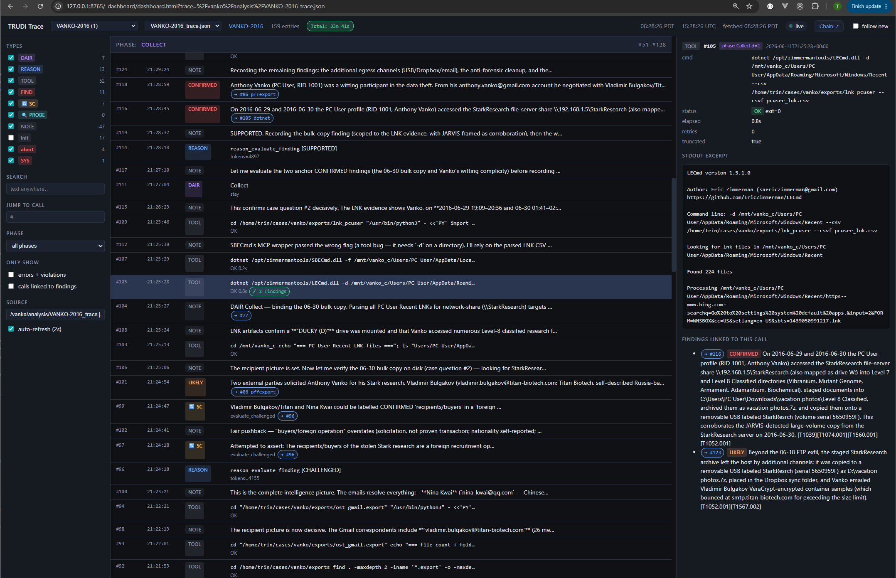
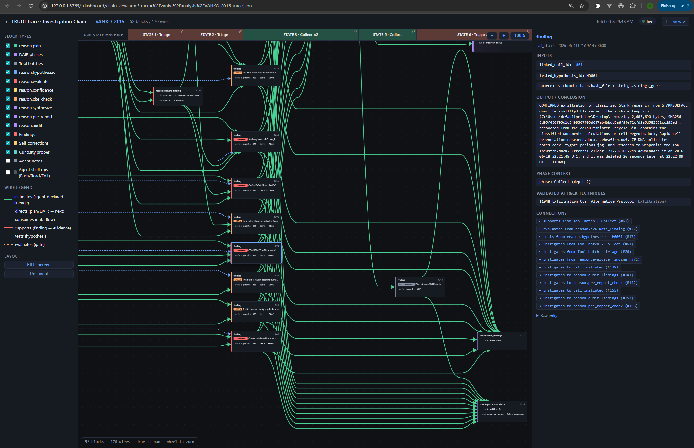

# TRUDI

**Threat Response Unit for Digital Investigation**

Autonomous DFIR agent built on the SANS SIFT Workstation. TRUDI runs a complete incident response investigation — disk triage, memory forensics, Windows artifact parsing, IOC enrichment, YARA hunting — and produces a structured analyst report with a full audit trail, without prompting for confirmation at each step.

A separate model directs the investigation phase-by-phase, and an adversarial reviewer challenges every conclusion before it reaches the report. TRUDI only reports what survives review.

Built for the [Find Evil! hackathon](https://findevil.devpost.com/) — SANS Institute / Devpost, April–June 2026.

---

## Contents

**This README:** [How it works](#how-it-works) · [Prerequisites](#prerequisites) · [Setup](#setup) · [API keys](#api-keys) · [Running a local model](#running-a-local-model) · [Starting a case](#starting-a-case) · [Live monitoring (experimental)](#live-monitoring--autonomous-response-experimental) · [What gets produced](#what-gets-produced) · [Trace dashboard](#trace-dashboard) · [Documentation](#documentation) · [Tool namespaces](#tool-namespaces) · [YARA rules](#bundled-yara-rules) · [Evidence constraints](#evidence-constraints) · [Test suite](#running-the-test-suite) · [Repository layout](#repository-layout) · [License](#license)

**Documentation:**

| Doc | What's in it |
|-----|--------------|
| [Try It Out](docs/try-it-out.md) | Step-by-step: browse a finished run (no key) or drive a fresh investigation end-to-end |
| [Architecture](docs/architecture.md) | Components, MCP boundary, guardrail tiers, security boundaries ([Mermaid source](docs/architecture.mmd) · [diagram PNG](docs/media/architecture.png)) |
| [Project Description](docs/project-description.md) | Design rationale — reasoning loop, gates, curiosity budget |
| [Dataset Documentation](docs/datasets.md) | Every case's provenance, evidence source, findings, and answer key |
| [Accuracy Report](docs/accuracy-report.md) | False positives, missed artifacts, hallucinations caught, confidence calibration, spoliation |
| [Live-monitoring demo](demo/live-monitoring/README.md) | *(experimental)* Velociraptor + victim Docker stack and the auto-protect loop walkthrough |
| [Live-endpoint testing](docs/live-endpoint-testing.md) | *(experimental)* Read-only `live.*` SSH triage against a running host |
| [Media](docs/media/README.md) | Dashboard screenshots + demo video notes |

---

## How it works

TRUDI is a **three-model system** — one analyst and two independently-configured reasoning models that direct and challenge it:

**Claude (primary analyst)** — orchestrates the investigation, selects tools, runs them via the TRUDI MCP server, interprets output, and writes the report.

**DAIR phase director** (`dair.*`) — runs the investigation as a recursive state machine (Triage → Collect → Analyze → Scan → Report). After every tool batch, `dair_assess` re-reads the evidence picture, decides the next phase, and emits a bound `priority_tools` work order. **DAIR prescribes; Claude executes.** Its backend is configured independently via `DAIR_BACKEND`.

**Adversarial reviewer** (`reason.*`) — challenges the investigation from two directions:

1. **Upstream** — at each Triage entry it generates a prioritized plan and competing hypotheses (including at least one non-leading actor/mechanism), binding which discriminating tools run first.
2. **Downstream** — before any conclusion reaches the report it evaluates the finding, scores confidence, checks citations, and runs a pre-report gate — flagging unsupported claims, logical gaps, and alternative explanations.

Both reasoning surfaces are swappable and **first-class in both directions**: `REASON_BACKEND` and `DAIR_BACKEND` each accept the Claude API or any OpenAI-compatible / local endpoint — a thinking model such as **Qwen3** or **DeepSeek-R1**, or a security-tuned local model such as **Titus** — over vLLM / SGLang / llama.cpp, and the two surfaces may run on different models. The models exchange structured `DIRECTIVES` blocks that bind tool selection for the next phase. Disagreements are resolved by a capped self-correction loop (max 3 iterations); unresolved items are reported as `UNCERTAIN` rather than dropped.

> **Backends:** run the reviewer and DAIR director on Claude (Opus) *or* on a local model — the harness is designed to hold analytical quality across backends, and both are documented as equals. See [Reasoning backends](#api-keys).

### Execution flow

```
case opened
    │
    ├─ misc.start_execution_log           ← trace log initialized
    ├─ [parallel] pre-plan triage         ← ez.recmd_hive ×3 + vol.symbol_check + hash.verify_evidence_hash
    ├─ reason.hypothesize (case question)  ← competing hypotheses, incl. ≥1 non-leading
    ├─ reason.plan                         ← prioritized Triage plan
    │
    └─ DAIR loop ── repeats until next_phase = Report ───────────────┐
         ├─ dair.dair_assess              ← phase decision + priority_tools work order
         ├─ [tool batch — disk, memory, artifacts, network, …]       │  (+ optional curiosity probes)
         │      └─ reason.hypothesize     ← per suspicious artifact   │
         └─ dair.dair_assess (results) ──────────────────────────────┘
    │
    (before any CONFIRMED/LIKELY finding)
    ├─ reason.evaluate_finding / confidence_score / cite_check
    ├─ misc.record_finding                 ← gated, linked to source call_id
    │
    (Report phase)
    ├─ reason.synthesize                   ← cross-finding consistency check
    ├─ reason.pre_report_check             ← blocks until findings + attribution resolved
    ├─ misc.export_execution_log           ← trace written to reports/
    └─ misc.write_final_report             ← gated final report write
```

Every tool call, DAIR call, reason call, and confirmed finding is written to a live JSON trace log throughout the investigation. The markdown export is human-readable.

---

## Prerequisites

1. **SANS SIFT Workstation** — Ubuntu 22.04 x86-64 with forensic tools (Volatility 3, EZ Tools, Sleuth Kit, Plaso, YARA, bulk_extractor, etc.)
   - Download: https://www.sans.org/tools/sift-workstation/

2. **Claude Code CLI** — the agent runtime
   - Install: `curl -fsSL https://claude.ai/install.sh | bash` (or `npm install -g @anthropic-ai/claude-code`)

3. **Python 3.10+** and **dotnet** — both included in SIFT Workstation

4. **Reasoning backends** — **required**
   TRUDI uses two independently-configured reasoning models — the adversarial reviewer (`REASON_BACKEND`) and the DAIR phase director (`DAIR_BACKEND`). These are core to how TRUDI works, not add-ons: without them the agent runs unsupervised, findings are never challenged or confidence-scored, and phase direction falls back to a static path. Configure both before running. Each takes the same options and may point at the same or different models:

   | Backend | Config |
   |---------|--------|
   | `claude` (default) | `ANTHROPIC_API_KEY=sk-ant-...` — no server required |
   | `openai-compat` | `REASON_URL` / `DAIR_URL` + `REASON_API_KEY` / `DAIR_API_KEY` |
   | Local model | `…_BACKEND=openai-compat` + `…_URL=http://localhost:8000` + `…_MODEL=<id>` |
   | Hosted (HF endpoint) | `…_BACKEND=openai-compat` + `…_URL=<hf-endpoint>` + `…_API_KEY=hf_...` |

   The simplest setup is Claude for both (add an `ANTHROPIC_API_KEY` and you're done); running the reviewer + DAIR on a local model is equally supported (see [Reasoning backends](#api-keys)). Either way a backend is required — TRUDI will start without one, but that is **not a supported way to evaluate it**: reason and DAIR calls are skipped and you're seeing a hollowed-out agent, not TRUDI.

### System forensic packages

`install.sh` installs these automatically (and enables the `universe` apt component if needed). On a full SIFT Workstation most are already present; on a leaner base, or if the installer logs a `!` warning about one, install them by hand:

```bash
sudo add-apt-repository -y universe        # pst-utils / pff-tools / tcpxtract live here
sudo apt-get update
sudo apt-get install -y pff-tools pst-utils binwalk tcpxtract sleuthkit ewf-tools
```

| apt package | Binaries | TRUDI tools that need it |
|-------------|----------|--------------------------|
| `pff-tools` | `pffexport`, `pffinfo` | `misc.pff_export` (PST/OST email extraction) |
| `pst-utils` | `readpst`, `lspst` | `misc.readpst_extract` (PST→mbox) — **not** `libpst-utils`; that package does not exist |
| `sleuthkit` | `fls`, `icat`, `istat`, `mmls`, `blkls`, `mactime`, `tsk_recover` | `tsk.*` |
| `ewf-tools` | `ewfmount`, `ewfinfo`, `ewfverify` | `ewf.*`, `img.*` E01 mounting |
| `tcpxtract` | `tcpxtract` | `net.tcpxtract_streams` |
| `binwalk` | `binwalk` | firmware / embedded carving |
| **chainsaw** (GitHub release `v2.10.2` → `/usr/local/bin`, not apt) | `chainsaw` | `misc.chainsaw_hunt` (Sigma over EVTX) — optional; TRUDI runs without it |

Verify after install: `for b in pffexport readpst fls ewfmount tcpxtract; do command -v "$b" || echo "MISSING: $b"; done`

---

## Setup

```bash
git clone https://github.com/nebulae/trudi ~/trudi
cd ~/trudi
./install.sh
```

`install.sh` does the following:

- Checks for `python3`, `dotnet`, and `claude` CLI
- Creates a Python venv at `~/.venv` and installs all dependencies
- Copies `.env.example` → `.env` (edit this to add API keys)
- **Backs up** any existing `~/.claude/CLAUDE.md` with a UTC timestamp, then installs the TRUDI orchestrator
- Registers Claude Code hooks and slash commands (run directly from the repo — no drift-prone deployed copies)
- Registers the TRUDI MCP server globally with `claude mcp add --scope global`
- Runs the full test suite (1,100+ tests) as a smoke check

If `~/.claude/CLAUDE.md` already exists, the backup is written to `~/.claude/CLAUDE.md.<YYYYMMDDTHHMMSS>.bak` — the original is never overwritten without a backup.

### API keys

Edit `~/trudi/.env`. TRUDI runs without any keys, but **missing keys degrade the run rather than break it** — and the degradation is not cosmetic:

| Key | Powers | If absent |
|-----|--------|-----------|
| `ANTHROPIC_API_KEY` | The `reason.*` reviewer and `dair.*` director (when `…_BACKEND=claude`) | **Reason and DAIR calls are skipped.** Findings are never challenged, confidence-scored, or citation-checked; phase direction falls back to a static path. The audit trail and analytical rigor that distinguish a TRUDI run are lost. |
| `VIRUSTOTAL_API_KEY` | `enrich.vt_lookup_*` | Hash/IP/domain reputation lookups return "unconfigured"; everything else proceeds. |
| `ABUSEIPDB_API_KEY` | `enrich.abuseipdb_check` | IP abuse scoring skipped; everything else proceeds. |

> **A reasoning backend is required** — either `ANTHROPIC_API_KEY` (Claude) or a local / OpenAI-compatible endpoint (below). The adversarial review and phase direction depend on it; a run with no backend is a hollowed-out agent, not TRUDI. The two enrichment keys are recommended (they add IOC corroboration) but optional and never block the investigation.

```bash
# IOC enrichment
VIRUSTOTAL_API_KEY=your_key_here
ABUSEIPDB_API_KEY=your_key_here

# Reasoning backends — reviewer + DAIR director. Pick ONE of the two blocks below
# for each (they may differ). Both backends are first-class.

# (A) Claude backend — Opus for both:
REASON_BACKEND=claude
DAIR_BACKEND=claude
ANTHROPIC_API_KEY=sk-ant-...          # used by both when backend=claude
REASON_MODEL=claude-opus-4-8
DAIR_MODEL=claude-opus-4-8

# (B) Local / OpenAI-compatible backend (see "Running a local model" below):
# REASON_BACKEND=openai-compat
# REASON_URL=http://localhost:8000     # or https://api.openai.com/v1
# REASON_API_KEY=sk-...                # if the endpoint needs one
# DAIR_BACKEND=openai-compat
# DAIR_URL=http://localhost:8000       # may differ from REASON_URL
```

### Running a local model

The reviewer and DAIR director run on any local model behind an OpenAI-compatible server (vLLM / SGLang / llama.cpp). This is a supported, first-class configuration — TRUDI has been driven end-to-end on local backends including [**Titus-CybersecurityLLM**](https://huggingface.co/AlicanKiraz0/Titus-CybersecurityLLM-v1.0-Q4_K_M-No-MTP-GGUF) (a security-tuned GGUF) and general thinking models such as **Qwen3**, producing complete, gated reports. Set `REASON_BACKEND=openai-compat` / `DAIR_BACKEND=openai-compat` and the `…_URL` / `…_MODEL` for each (they may differ). Two families:

**A security-tuned model over llama.cpp** — e.g. [Titus](https://huggingface.co/AlicanKiraz0/Titus-CybersecurityLLM-v1.0-Q4_K_M-No-MTP-GGUF), a quantized GGUF:
```bash
llama-server -m Titus-CybersecurityLLM-v1.0-Q4_K_M-No-MTP.gguf \
  -c 32768 -np 1 --host 0.0.0.0 --port 8000
# then set: REASON_BACKEND=openai-compat, REASON_URL=http://localhost:8000
```

**Thinking models** (Qwen3, DeepSeek-R1, gpt-oss … over vLLM / SGLang / llama.cpp):

Thinking models spend a chain-of-thought *before* the answer, and every server bills those
tokens against `max_tokens`. TRUDI keeps thinking enabled and budgets for it instead:

```bash
REASON_BACKEND=openai-compat
REASON_URL=http://localhost:8000
REASON_MODEL=unsloth/Qwen3.8-27B-GGUF:Q4_K_M  # the id your server lists at GET /v1/models
DAIR_BACKEND=openai-compat          # (auto-discovered from /v1/models if left unset)
DAIR_URL=http://localhost:8000
DAIR_MODEL=unsloth/Qwen3.8-27B-GGUF:Q4_K_M

TRUDI_COMPAT_THINKING_BUDGET=8192   # extra output tokens reserved for the think phase
TRUDI_COMPAT_MAX_TOKENS_CEILING=32768  # ≤ per-slot context (n_ctx / n_parallel) − ~5.5k prompt
TRUDI_DAIR_MAX_TOKENS=8192          # DAIR's answer budget (default 4096). A very "chatty"
                                    # thinking model can burn the whole budget on chain-of-
                                    # thought and truncate the DAIR JSON — raise this (the
                                    # request budget is TRUDI_DAIR_MAX_TOKENS + THINKING_BUDGET)
TRUDI_REASON_TIMEOUT=1200           # a 27B at ~40 tok/s needs ~4 min for 10k tokens
TRUDI_DAIR_TIMEOUT=1200
# TRUDI_COMPAT_THINKING_GUIDANCE=   # brevity line appended to compat system prompts; "off" disables
# TRUDI_COMPAT_NO_THINK_TOOLS=dair_assess,reason_cite_check,reason_confidence_score,reason_audit_findings  # default
# TRUDI_COMPAT_EXTRA_BODY='{"chat_template_kwargs":{"enable_thinking":true}}'  # optional pass-through
```

Thinking is a per-surface switch: by default DAIR and the mechanical checks (`cite_check`,
`confidence_score`, `audit_findings`) run with `enable_thinking=false` + `/no_think`, while
`hypothesize` / `evaluate_finding` / `synthesize` / `plan` keep it. Measured on a 27B at 40 tok/s
with thinking everywhere: hypothesize 8.6k tokens / 197 s, DAIR 14.6k tokens / 341 s. That
matters because **Claude Code backgrounds any tool call running past
`CLAUDE_CODE_MCP_AUTO_BACKGROUND_MS` (default 120 s) and lets the agent continue without the
result** — which silently breaks the DAIR-driven loop. Either keep every reason/DAIR call under
that cutoff, or raise it in the case's `.claude/settings.json` (`"env": {"CLAUDE_CODE_MCP_AUTO_BACKGROUND_MS": "0"}`
disables backgrounding; pair with a per-server `"timeout"` in `.mcp.json`).

Size the ceiling to the server: llama-server splits `-c` across `-np` slots, and concurrent
reason + DAIR calls share the KV cache — a request that cannot fit returns HTTP 500
`Context size has been exceeded` for *every* in-flight request. `-c 32768 -np 1` with
`CEILING=26624` / `THINKING_BUDGET=12288` is a working baseline for a 27–35B thinking model.

How it behaves: the request budget is `max_tokens + THINKING_BUDGET`. If the server returns
`finish_reason=length` with an empty answer (the whole budget went to thinking), TRUDI retries
once at double the budget (capped at the ceiling). Chain-of-thought in `reasoning_content` or
`<think>…</think>` is captured as diagnostics (`backend_meta.reasoning_*` on the trace entry),
never promoted to the answer. Failed calls record their cause on the `reason_call` / `dair_call`
entry plus a `call_abandoned` entry. Set `TRUDI_COMPAT_THINKING_BUDGET=0` for non-thinking chat
models (e.g. GPT-class) to use the legacy single-attempt path.

---

## Starting a case

### 1. Create the case directory

```bash
cp -r ~/trudi/case-template ~/cases/<CASE_ID>
```

### 2. Edit the case CLAUDE.md

Fill in evidence paths, hostnames, and scope in `~/cases/<CASE_ID>/CLAUDE.md`. This is the only manual step — everything else is autonomous.

```
~/cases/<CASE_ID>/
├── CLAUDE.md                  ← edit this
├── .claude/
│   └── settings.json          ← MCP tool allowlist (pre-populated)
├── evidence/                  ← place disk images and memory captures here
├── analysis/                  ← intermediate artifacts (auto-created)
├── exports/                   ← tool output: CSV, JSON, bodyfiles (auto-created)
└── reports/                   ← final report + trace log (auto-created)
```

### 3. Place evidence

```bash
cp /path/to/image.E01 ~/cases/<CASE_ID>/evidence/
cp /path/to/memory.img ~/cases/<CASE_ID>/evidence/
```

### 4. Open Claude Code in the case directory

```bash
cd ~/cases/<CASE_ID>
claude
```

### 5. Start the investigation

```
Investigate this case. Start with the pre-enumeration triage, then follow the plan.
```

TRUDI will run autonomously from there. It will not ask for confirmation between steps. Final output is a structured report in `reports/` and a full execution trace in both JSON and markdown.

---

## Live monitoring & autonomous response (experimental)

> **Status: experimental.** This layer runs today but is scaffolding; the core of TRUDI is the read-only static investigator described above. It's documented here for completeness.

Beyond static-image investigation, TRUDI can watch a live endpoint via Velociraptor and respond autonomously. This is the only mode where TRUDI writes to a system, and only *outside* the evidence boundary, through a separately gated path.

- `monitor.*` — baseline capture, watcher lifecycle, alert draining, per-investigation traces
- `velo.*` — read-only Velociraptor API (clients, artifact collection, VQL)
- `live.*` — read-only live triage over SSH (processes, network, persistence, services, logons)
- `respond.*` — **gated** containment (process suspend/kill, network block) over a structured, type-validated SSH path

**Auto-protect** (default on) auto-executes the *reversible + low-risk* tier of containment and surfaces each action's rollback command; anything destructive (irreversible, or risk ≥ medium) pauses the loop until the operator types `approve ACT-N`. The auto-vs-approval boundary is server-classified from each recipe's `risk`/`reversible` metadata — the agent cannot reclassify it.

**Try it end-to-end:** [demo/live-monitoring/README.md](demo/live-monitoring/README.md) — a self-contained Velociraptor + victim Docker stack with one-command bring-up, staged Atomic Red Team attacks, and a full walkthrough of the TRUDI loop (baseline → watcher → alert drain → auto-protect, including the `approve ACT-N` flow). It's driven by the bundled `/trudi-*` slash commands (`/trudi-start-watcher`, `/trudi-watch-alerts`, `/trudi-check-alerts`, `/trudi-stop-watcher`, `/trudi-clear-case`), which `install.sh` installs to `~/.claude/commands/`. For the read-only SSH triage path on its own, see [docs/live-endpoint-testing.md](docs/live-endpoint-testing.md).

---

## What gets produced

| File | Contents |
|------|----------|
| `reports/<CASE_ID>_investigation_report.md` | Structured analyst report — executive summary, attack timeline, findings with confidence levels, environment caveats |
| `reports/<CASE_ID>_trace.md` | Human-readable audit trail — every tool call, reason call, and confirmed finding with UTC timestamps |
| `reports/<CASE_ID>_trace.json` | Machine-readable trace — same data, structured for ingestion |
| `analysis/<CASE_ID>_trace.json` | Live trace (written incrementally during the investigation) |
| `exports/` | Raw tool output — MFT CSV, EVTX exports, prefetch, registry, amcache, shimcache, USN journal, netscan, etc. |

## Trace dashboard

Every investigation writes a live JSON trace; the bundled dashboard renders it in the browser as it runs. Launch it once and it serves every case under `~/cases`:

```bash
./dashboard.sh                 # serves ~/cases on http://127.0.0.1:8765
./dashboard.sh --port 9090
./dashboard.sh --cases-root /data/cases
```

`install.sh` also installs a `trudi-dashboard` launcher to `/usr/local/bin`. At case open TRUDI prints the live dashboard URL for the active trace, so you can watch the investigation unfold in real time.

| View | Shows |
|------|-------|
| **Trace Viewer** | Chronological stream of every tool call, DAIR call, reason call, and finding — UTC timestamps, arguments, and gate results |
| **Investigation Chain** | Finding-lineage chain — each finding linked back through `input_call_ids` to the exact tool executions that produced it |
| **Investigation Graph** | The trace as a causal DAG — hypotheses, tool runs, and findings as nodes; lineage as edges |

**Trace Viewer** — every tool / DAIR / reason call and finding, with arguments and gate results:



**Investigation Chain** — each finding linked back through `input_call_ids` to the exact tool executions that produced it:



<!-- Graph view: drop docs/media/dashboard-graph.png and uncomment:

-->

> 📹 **Demo video:** [TRUDI walkthrough](https://youtu.be/Dbx5DcH6V5E)
> · 📦 **Demo run bundle** (trace, report, console): [cases/vanko/](cases/vanko/README.md)

---

## Documentation

| Doc | What |
|-----|------|
| [Architecture](docs/architecture.md) | Components, MCP boundary, guardrail tiers, security boundaries ([Mermaid source](docs/architecture.mmd)) |
| [Project description](docs/project-description.md) | Design rationale — the reasoning loop, gates, curiosity budget |
| [Datasets](docs/datasets.md) | Each case's source, evidence pointer, and expected findings; runs bundled under [cases/](cases/) and installed to `~/cases/` for the dashboard |
| [Accuracy report](docs/accuracy-report.md) | False positives, missed artifacts, hallucinations caught in testing, confidence calibration, and an evidence-integrity / spoliation section |
| [Try it out](docs/try-it-out.md) | Browse a finished run in ~2 min (no key), or drive a fresh investigation end-to-end |
| [Execution logs](cases/vanko/README.md) | A committed run's trace + report + console; every bundled case under [cases/](cases/) ships its full trace (`reports/<CASE_ID>_trace.{json,md}` via `misc.export_execution_log`) |
| [Demo video](https://youtu.be/Dbx5DcH6V5E) | End-to-end run walkthrough |

Experimental extras: [live-monitoring walkthrough](demo/live-monitoring/README.md) (Velociraptor + auto-protect) and [live-endpoint triage](docs/live-endpoint-testing.md) (read-only `live.*` over SSH).

Every finding in an execution log links to the exact tool call that produced it — viewable live in the [Trace dashboard](#trace-dashboard). Start with [How it works](#how-it-works), then [Try it out](docs/try-it-out.md).

---

## Tool namespaces

All forensic execution goes through the TRUDI MCP server — **25 namespaces** in total. Claude never calls binaries directly when an MCP tool exists.

| Namespace | Domain | Key tools |
|-----------|--------|-----------|
| `img.*` | Disk image mounting | `ewf_mount`, `vshadow_mount`, `bde_mount`, `xmount`, `photorec_carve`, `losetup_create` |
| `vol.*` | Memory forensics (Volatility 3) | `pstree`, `pslist`, `psscan`, `cmdline`, `netscan`, `dlllist`, `malfind`, `hollowprocesses`, `pebmasquerade`, `suspicious_threads`, `scheduled_tasks`, `registry_hivelist`, `dumpfiles` |
| `tsk.*` | Filesystem (Sleuth Kit) | `fls`, `icat`, `istat`, `ils`, `mactime`, `tsk_recover`, `sigfind`, `mmls`, `fsstat`, `jls`, `jcat` |
| `ewf.*` | E01 images | `ewf_mount`, `ewf_info`, `ewf_verify`, `mount_full_image`, `mount_ntfs` |
| `ez.*` | Windows artifacts (EZ Tools) | `mftecmd`, `evtxecmd`, `recmd_hive`, `amcacheparser`, `appcompatcacheparser`, `pecmd`, `lecmd`, `jlecmd`, `sbecmd`, `wxtcmd`, `sqlecmd`, `rbcmd` |
| `plaso.*` | Super-timeline | `plaso_create_timeline`, `plaso_export_csv`, `plaso_filter_incident_window`, `plaso_info` |
| `yara.*` | Threat hunting | `yara_scan_file`, `yara_scan_directory`, `yara_scan_memory_image`, `yara_scan_strings` |
| `hash.*` | Integrity / similarity | `hash_file`, `hash_directory`, `verify_evidence_hash`, `ssdeep_hash`, `hashdeep_compute` |
| `strings.*` | Static analysis | `strings_extract`, `strings_grep`, `hexdump`, `file_identify`, `exiftool_metadata`, `stat_file` |
| `carve.*` | File carving | `carve_bulk_extractor_scan`, `carve_foremost_carve`, `carve_scalpel_carve` |
| `net.*` | Network analysis | `tcpdump_read`, `tcpdump_extract_http`, `tcpdump_extract_dns`, `tcpdump_extract_ips`, `ngrep_search` |
| `enrich.*` | Threat intel | `vt_lookup_hash`, `vt_lookup_ip`, `vt_lookup_domain`, `abuseipdb_check` |
| `misc.*` | Windows artifacts | `evtx_dump`, `evtx_filter`, `regripper_hive`, `parse_scheduled_tasks`, `usbdeviceforensics`, `usnparser_parse`, `analyzeMFT_parse`, `hindsight_chrome`, `clamscan_file`, `pe_scanner`, `pdf_parser_analyze` |
| `read.*` | Produced-output reads (traced, citable) | `read_output` (CSV/JSON/TXT under analysis/exports/reports — query, columns, where), `read_mail` (extracted mbox/.eml — message bodies, sender/recipient roster) |
| `reason.*` | Adversarial review | `reason_plan`, `reason_hypothesize`, `reason_evaluate_finding`, `reason_confidence_score`, `reason_cite_check`, `reason_synthesize`, `reason_pre_report_check` |
| `dair.*` | Phase director (state machine) | `dair_assess` |
| `correlate.*` | Cross-tool correlation | `process_to_file`, `network_to_process`, `mitre_map`, `mitre_validate` |
| `accuracy.*` | Ground-truth scoring | `accuracy_compare`, `accuracy_export_report` |
| `coverage.*` | Evidence coverage reporting | `coverage_report` |
| `af.*` | Anti-forensics detection | `timestomp_drift`, `event_log_clear`, `sysmon_evasion`, `usn_gaps`, `prefetch_deletion` |
| `attribution.*` | Threat-actor attribution | `attribute_actors` |
| `live.*` | Live endpoint triage (read-only, SSH) | `live_processes`, `live_network_connections`, `live_persistence_audit`, `live_services`, `live_recent_logins`, `live_yara_scan` |
| `velo.*` | Velociraptor API (read-only re: evidence) | `list_clients`, `collect_artifact`, `wait_for_flow`, `get_collection_results`, `query` |
| `monitor.*` | Live-monitoring lifecycle | `baseline_capture`, `start_watcher`, `check_alerts`, `start_investigation`, `end_investigation` |
| `respond.*` | **Gated** containment & response | `suggest_containment`, `approve_action`, `execute_action`, `revert_action` |

> `live.*`, `velo.*`, `monitor.*`, and `respond.*` belong to the **experimental live-monitoring layer** (see [above](#live-monitoring--autonomous-response-experimental)) and are not part of the core static investigator.

---

## Bundled YARA rules

Located in `rules/` — used automatically by `yara.*` tool calls:

| Ruleset | Covers |
|---------|--------|
| `cobalt_strike/` | Default named pipes, reflective loader, stager patterns, beacon config |
| `persistence/` | Scheduled task XML anomalies, Run key patterns, service install signatures |
| `lateral_movement/` | Pass-the-hash, net use, SMB lateral movement indicators |
| `powershell/` | Obfuscated PowerShell, AMSI bypass, download cradles |
| `anti_forensics/` | Log clearing, timestomping, MFT manipulation indicators |

---

## Evidence constraints

TRUDI enforces read-only evidence handling at the executor level — not just by instruction. The `core/paths.py` module blocks any output write that resolves to `/cases/`, `/mnt/`, `/media/`, or any path containing an `evidence/` segment. This check runs before every subprocess call that takes an output path. It cannot be bypassed via prompt.

All tool output is capped at 50 KB / 150 lines before being returned to the agent to prevent context flooding. Truncation is flagged explicitly in the response.

---

## Running the test suite

```bash
cd ~/trudi
source ~/.venv/bin/activate
pytest -n auto --no-cov -q        # ~30 s on a many-core box (parallel, no coverage)
pytest --cov --tb=short           # serial with coverage (CI shape; a few minutes)
```

1,700+ tests. All tool calls are mocked — tests run without SIFT tools installed.
The suite is I/O-bound (every test writes a trace): tests run with the trace
`fsync` off and a per-test `hook.lock` (`tests/conftest.py`), so `-n auto`
scales linearly — and never contends with a live TRUDI session.

---

## Repository layout

```
trudi/
├── server.py              ← FastMCP server — mounts all 24 tool namespaces
├── install.sh             ← one-command setup on a SIFT Workstation
├── claude/
│   └── CLAUDE.md          ← global orchestrator (installed to ~/.claude/CLAUDE.md)
├── case-template/         ← starter case directory for new investigations
│   ├── CLAUDE.md
│   ├── .claude/settings.json
│   └── evidence/ analysis/ exports/ reports/
├── cases/                 ← bundled case studies (traces + reports, no evidence)
│   └── <CASE>/            ← installed to ~/cases/ for the dashboard (see docs/datasets.md)
├── docs/                  ← docs: architecture, accuracy-report, datasets,
│                            project-description + media/ (screenshots, demo video notes)
├── core/
│   ├── executor.py        ← safe subprocess runner (retry, timeout, line cap)
│   ├── execution_log.py   ← trace log singleton
│   └── paths.py           ← evidence path enforcement + tool binary locations
├── tools/                 ← one module per MCP namespace (24 total)
├── rules/                 ← bundled YARA rulesets (5 categories)
└── tests/                 ← full test suite (1,100+ tests, mocked)
```

---

## License

Released under the [MIT License](LICENSE). © 2026 Trinity Harrison.
